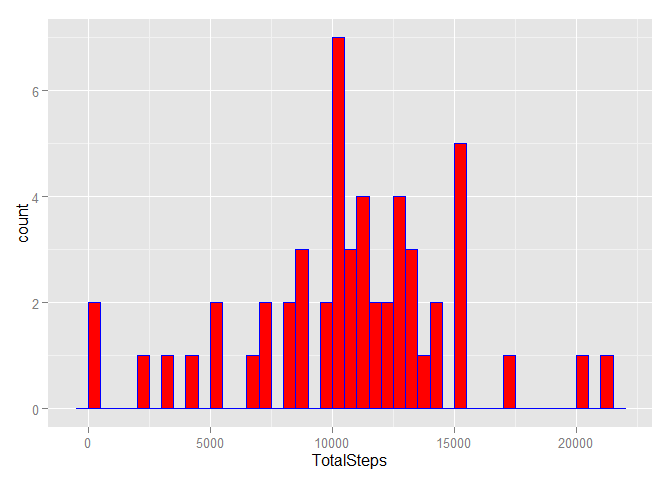
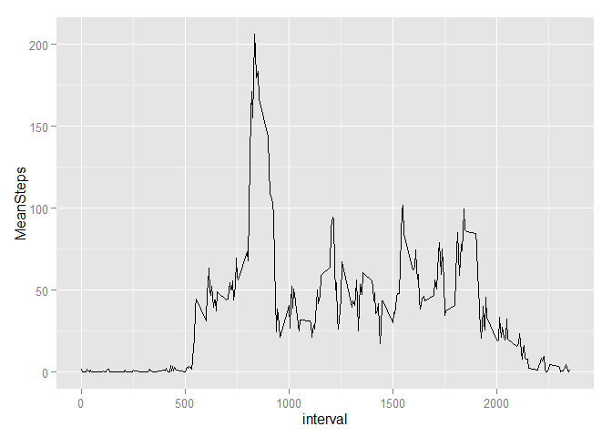
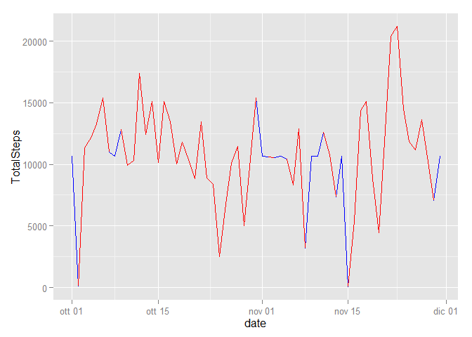
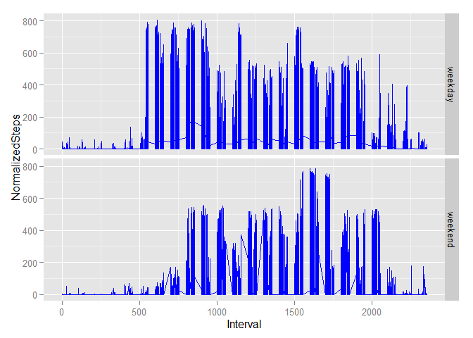

# Reproducible Research: Peer Assessment 1
This Report delivers answers to specific questions raised by the first "Peer Assessment Test", related to the analysis of  personal activity monitoring devices.

For graphs the "GGPLOT" plotting System has been adopt. I'm aware the code is not optimized but time constraints led me to focus on the "spririt" and final purpose of this specific assignment which is using knitr package.

------------


## Loading and preprocessing the data
# 1 Fetch the data  
Data are dowloaded from the URL ""https://d396qusza40orc.cloudfront.net/repdata%2Fdata%2Factivity.zip" and a specific directory is structured for hosting the downloaded file. Given the wd, a subdirectory "PA1" is created (if not available) wher the file is dowloaded. File is extracted there. 


```r
library(ggplot2)
```

```
## Warning: package 'ggplot2' was built under R version 3.2.2
```

```r
library(lubridate)
```

```
## Warning: package 'lubridate' was built under R version 3.2.2
```

```r
library(dplyr)
```

```
## 
## Attaching package: 'dplyr'
## 
## The following objects are masked from 'package:lubridate':
## 
##     intersect, setdiff, union
## 
## The following object is masked from 'package:stats':
## 
##     filter
## 
## The following objects are masked from 'package:base':
## 
##     intersect, setdiff, setequal, union
```

```r
#Dowload .zip File
fileUrl<-"https://d396qusza40orc.cloudfront.net/repdata%2Fdata%2Factivity.zip"
mainDir <- getwd()
subDir <- "PA1"
if (!file.exists(subDir)) {dir.create(file.path(mainDir, subDir))}
zipFile<-"./PA1/PA1.zip"
download.file(fileUrl,zipFile, method="libcurl", mode = "wb")

#Unzip.zip File
unzip(zipFile, exdir = "./PA1/data")

#Prepare Basic Dataset
activity2 <- read.csv("./PA1/data/activity.csv")
activity2$date<-ymd(activity2$date)
```


## What is mean total number of steps taken per day?

Observation are grouped by date (i.e. day) and 3 stats are caluated:(Total number, average number, mean number)  
na.rm = TRUE has been used given high number of "NA" values".  
median value equal to "0" in many case looks strange; it would require further analysis

```r
y<-tbl_df(activity2)%>% 
        group_by(date)%>% 
                summarise(TotalSteps= sum(steps), MeanSteps=mean(steps, na.rm=TRUE), MedianSteps=median(steps,na.rm=TRUE))
```


Total number of steps taken each day is represented by a Hystogram

```r
g<-ggplot(y, aes(x=TotalSteps))
g + geom_histogram(binwidth = 500, colour="blue", fill="red")
```

 

The table below highlights the mean and median of the total number of steps taken per day (further analysis needed on median values)


```r
z<-dplyr::select(y, -TotalSteps)
print(z)
```

```
## Source: local data frame [61 x 3]
## 
##          date MeanSteps MedianSteps
## 1  2012-10-01       NaN          NA
## 2  2012-10-02   0.43750           0
## 3  2012-10-03  39.41667           0
## 4  2012-10-04  42.06944           0
## 5  2012-10-05  46.15972           0
## 6  2012-10-06  53.54167           0
## 7  2012-10-07  38.24653           0
## 8  2012-10-08       NaN          NA
## 9  2012-10-09  44.48264           0
## 10 2012-10-10  34.37500           0
## ..        ...       ...         ...
```


## What is the average daily activity pattern?
The following graph dscribe the time series plot, using a solide line, of average number of steps (y) per interval (x)  
Data are summarized in fact by "interval"


```r
intv<-tbl_df(activity2)%>% 
        dplyr::group_by (interval)%>% 
                dplyr::summarize (MeanSteps = mean(steps, na.rm=TRUE))

g<-ggplot(intv, aes(x=interval, y=MeanSteps))
g + geom_line()
```

 


The interval that contains the maximum number of steps is the "int_max" that is provided below.
The data has been identified, calculating the maximum value of steps (i.e.max)and looking-up the interval that show-up that value. 


```r
maxint<-tbl_df(activity2)%>% dplyr::group_by(interval)%>% dplyr::summarize (TotalSteps=sum(steps,na.rm=TRUE))
max<-max(maxint$TotalSteps)
int_max<-as.character(dplyr::filter(maxint, TotalSteps==max)%>%dplyr::select(interval))
print(int_max)
```

```
## [1] "835"
```


## Imputing missing values

A number of observation are missing their number is described below:


```r
NAsteps<-sum(is.na(activity2$steps))
NAdate<-sum(is.na(activity2$date))
NAinterval<-sum(is.na(activity2$interval))
print(NAsteps)
```

```
## [1] 2304
```

In order to "Normalize" the data, substituing the missing values, the strategy chosen, consists in using the "average number of step per interval", when the specific interval for a specific day got missing values.
the df "activity3" is the new df with the observation substituted


```r
NoMiss<-group_by(activity2,interval)%>% 
                summarise(MeanSteps=mean(steps, na.rm=TRUE))
end<-dim(activity2)
normalSteps<-vector(length=end[1])
for (i in 1:end[1]){
        if(is.na(activity2[i,1])) {
                m<-filter(NoMiss, interval==activity2[i,3])
                normalSteps[i]<-as.integer(m$MeanSteps)
                } else
                        {
                        normalSteps[i]<-as.integer(activity2$steps[i])
                        }
        }
activity3<-mutate(activity2, normalSteps=normalSteps)
```


There are specific differences in the number of steps, the results can be looked at in the following graph, where it is shown the histogram of data without missing data. Please observe blue segment highligthing missing values and reconnect that existing. 


```r
library(dplyr)
yNormal<-tbl_df(activity3)%>% 
        dplyr::group_by(date)%>% 
                dplyr::summarise(TotalSteps= sum(normalSteps), MeanSteps=mean(normalSteps, na.rm=TRUE), 
                                 
                                 MedianSteps=median(normalSteps,na.rm=TRUE))
yNormal2<-cbind(yNormal, y$TotalSteps)
names(yNormal2)<-c( "date","TotalSteps","MeanSteps","MedianSteps","NASteps")

g<-ggplot(yNormal2, aes(x=date))
g + geom_line(aes(y=TotalSteps),colour="blue")+geom_line(aes(y=NASteps),colour="red")
```

```
## Warning in loop_apply(n, do.ply): Removed 2 rows containing missing values
## (geom_path).
```

 


The number of steps added from normalization process is significant, pleasee see the additional number of steps poured in: 


```r
sum_diff<-dplyr::summarise (yNormal2,woNA= sum(TotalSteps, na.rm=TRUE), wNA=sum(NASteps, na.rm=TRUE))
diff<-as.integer(sum_diff[1]-sum_diff[2])
```


## Are there differences in activity patterns between weekdays and weekends?
The answer is obviously YES and it in mainy in the distribution of steps during the intervals. The comparison of behavioural patterns are shown in the graph


```r
end<-dim(activity3)
beHave<-vector(length=end[1])
weekend<-c("sabato","domenica")
for (i in 1:end[1]){
        if(weekdays(activity3$date[i])%in% weekend){beHave[i]="weekend"} 
           else{beHave[i]="weekday"}
        }

Norm_activity<-as.data.frame(cbind(activity3$date,beHave, activity3$interval,activity3$normalSteps))
names(Norm_activity)<-c("date", "behaviour","Interval", "NormalizedSteps")
Norm_activity$date<-activity3$date
Norm_activity$NormalizedSteps<-as.numeric(activity3$normalSteps)
Norm_activity$Interval<-as.numeric(activity3$interval)

g<-ggplot(Norm_activity, aes(x=Interval))
g + geom_line(aes(y=NormalizedSteps),colour="blue")+ facet_grid(behaviour~.)
```

 


